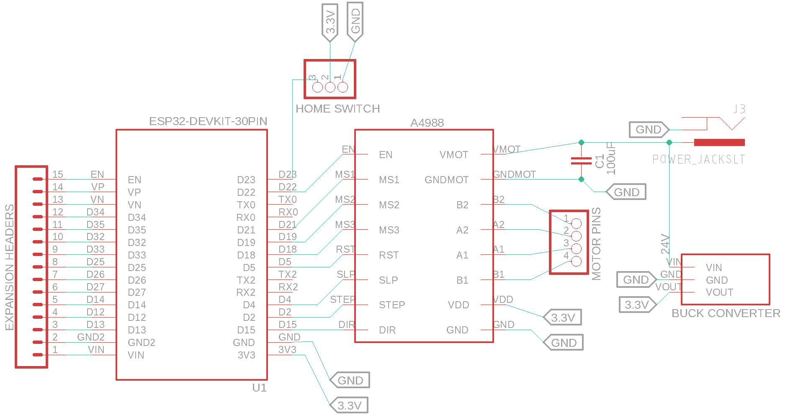
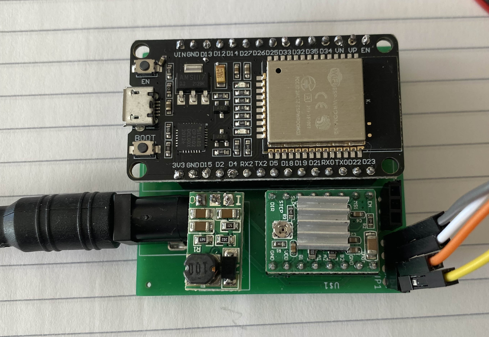
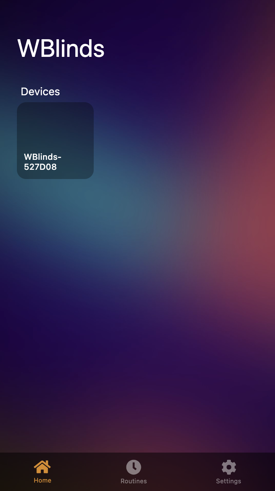
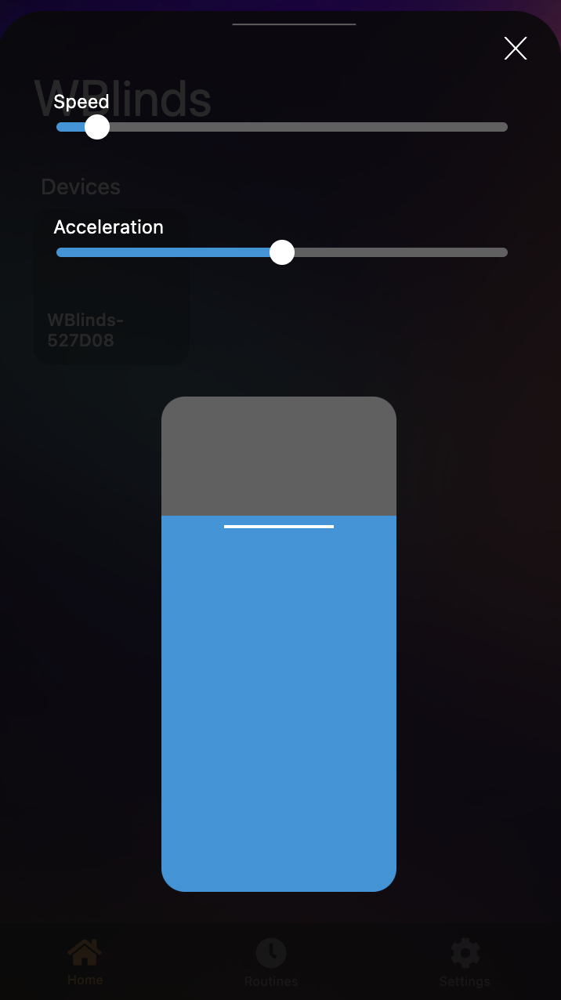
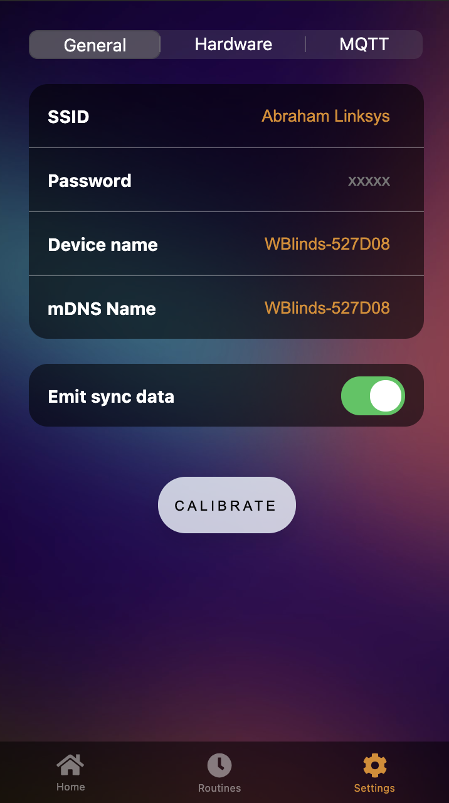
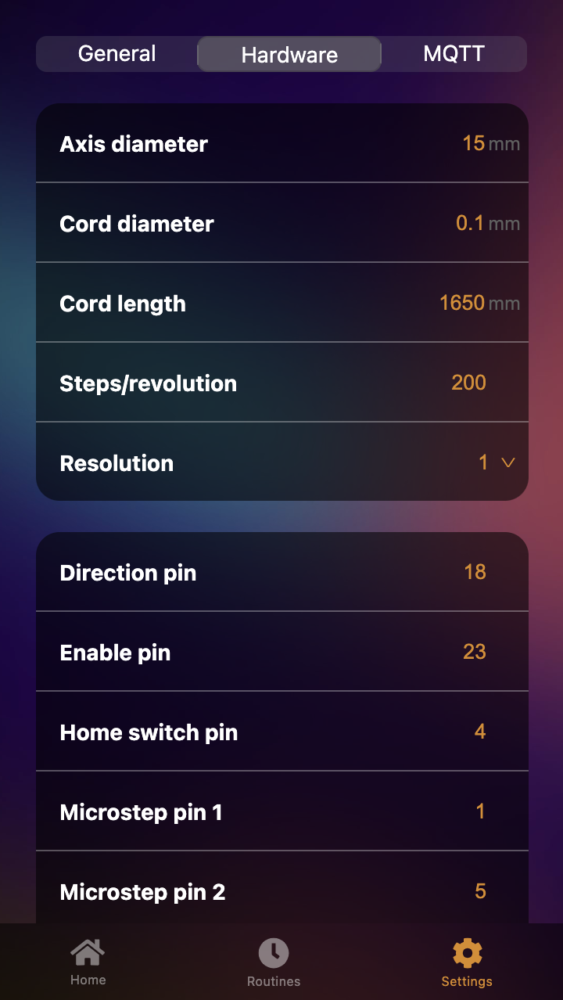
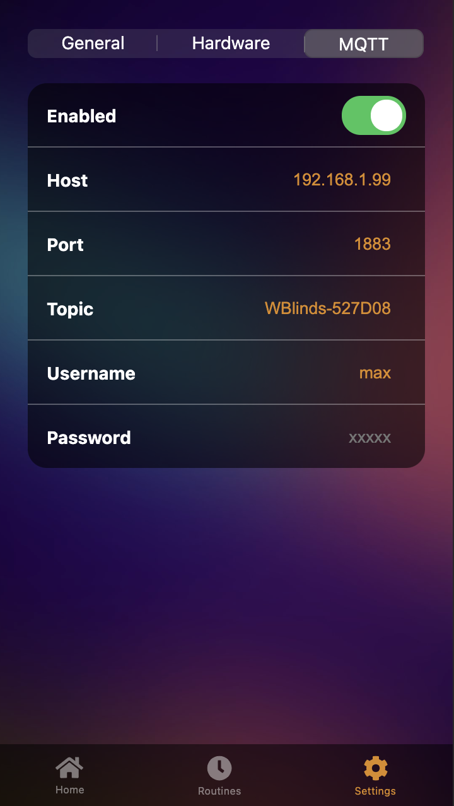

Build Wifi-connected smart blinds using ESP32 and off-the-shelf components for <$50.

🌟 Including...
* [HTTP/REST API](#http)
* [MQTT API](#mqtt) & client
* Native [Homekit](#homekit) integration
* Halts on home detection
* [Web UI](#web-ui) for controlling/configuring


## Table of Contents
<!--ts-->
   * [Setup](#setup)
      * [Hardware](#hardware)
      * [Circuit](#circuit)
      * [Software](#software)
   * [APIs](#apis)
   * [Web UI](#web-ui)
   * [Configuration](#configuration)
   * [Development](#development)
      * [Custom Integrations](#custom-integrations)
   * [Appendix](#appendix)
      * [Other Files](#other-files)
      * [Choosing a Motor](#choosing-a-motor)
<!--te-->

<h2 id="setup">✏️ Setup</h2>

### Hardware
These are some suggestions for hardware to use. The first link in each row is the product I used for the prototype. All links are non-affiliate and can be found elsewhere if you look around. Prices are estimates including shipping at the time I purchased and may have changed since then; I suggest searching around if so.

<table>
  <tbody>
    <tr>
      <th>Part ~~~~~~~~</th>
      <th>Purchase Links ~~~~~~~~~~~~~~~~~~~~~~~~~~~~</th>
      <th>Notes <br> ~~~~~~~~~~~~~~~~~~~~~~~~~~~~</th>
    </tr>
    <tr>
      <td>ESP32</td>
      <td>
        • <a href=https://www.aliexpress.com/item/1005001648850998.html>32S Devkit "V1" (AliExpress, $4)</a><br>
        • <a href=https://www.mouser.com/ProductDetail/Espressif-Systems/ESP32-S2-DevKitM-1?qs=DPoM0jnrROXzO8seOHN%252BOQ%3D%3D>32S Devkit M1 (Mouser, $8)</a><br>
        • <a href=https://www.amazon.com/HiLetgo-ESP-WROOM-32-Development-Microcontroller-Integrated/dp/B0718T232Z>NodeMCU-32 (Amazon, $11)</a>
      </td>
      <td>Circuit below wass using the first link. Pin assignments may vary between boards, often the same pins but more/less extra pins, or power pins are in different places. Be sure to check the pinout.</td>
    </tr>
    <tr>
      <td>Stepper Driver</td>
      <td>
        • <a href=https://www.aliexpress.com/item/1005001374747956.html>A4988 (AliExpress, $2)</a><br>
        • <a href=https://www.pololu.com/product/1182>A4988 (Polulu, $6)</a><br>
        • <a href=https://www.amazon.com/Aokin-StepStick-Stepper-Driver-Printer/dp/B07JV835SW>5x A4988 (Amazon, $8)</a>
      </td>
      <td>Other drivers would work too, currently only A4988 is tested (using <a href=https://github.com/gin66/FastAccelStepper>FastAccelStepper</a>). <br><br> Be sure to <a href=https://youtu.be/89BHS9hfSUk>set the current limit</a> before attaching your motor.</td>
    </tr>
    <tr>
      <td>Stepper Motor</td>
      <td>
        • <a href=https://www.aliexpress.com/item/1005002191787745.html>1.5A 45Ncm (AliExpress, $18)</a><br>
         <a href="https://www.omc-stepperonline.com/nema-17-bipolar-42ncm-59-49oz-in-1-5a-42x42x39mm-4-wires-w-1m-cable-and-connector.html">1.5A 42Ncm (StepperOnline, $5 at time of writing)</a>
        • <a href=https://www.pololu.com/product/2267>1.7A 36Ncm (Polulu, $18)</a><br>
        • <a href=https://www.amazon.com/Twotrees-Stepper-17HS4401-Connector-Printer/dp/B07THK76QQ>1.5A 42Ncm (Amazon, $10)</a>
      </td>
      <td>This may be over/underpowered for your needs, depending on the weight of the blinds. <br> <br> See <a href="#choosing-a-motor">choosing a motor</a>. <br> <br> 
      Note: The newest 3d designs use a worm gear with a 30:1 reductions so a much smaller motor will work, but the movement speed is greatly reduced with that design.</td>
    </tr>
    <tr>
      <td>3.3V Step-down Regulator</td>
      <td>
        • <a href=https://www.aliexpress.com/item/4000714041437.html>5-40V to 3.3V (AliExpress, $2)</a><br>
        • <a href=https://www.pololu.com/category/209/d24v5fx-step-down-voltage-regulators>D24V5Fx (Polulu, $5)</a><br>
        • <a href=https://www.amazon.com/Anmbest-AMS1117-3-3-4-75V-12V-Voltage-Regulator/dp/B07CP4P5XJ>10x 5-12V to 3.3v (Amazon, $9)</a>
      </td>
      <td>Circuit below is using the one from AliExpress.  Others may have different number of pins or pin orders, so check the pinout before wiring.</td>
    </tr>
    <tr>
      <td>Power supply</td>
      <td>
        • <a href=https://www.aliexpress.com/item/1005001555277278.html>24V 5A (AliExpress, $13)</a><br>
        • <a href=https://www.pololu.com/product/1468>12V 5A (Polulu, $19)</a><br>
        • <a href=https://www.amazon.com/Converter-100-220V-Transformer-5-5x2-1mm-Accessories/dp/B08C594VNP>12V 5A (Amazon, $10)</a>
      </td>
      <td>You can (and probably want to) use a voltage over the motor's rating.  That's fine, you just need to stay below it's rated current. <br> <br>  The current needed depends on motor rating and how many blinds you'll be moving simultaneously with the same power supply.</td>
    </tr>
    <tr>
      <td>DC barrel jack</td>
      <td>
        • <a href=https://www.aliexpress.com/item/4000215113209.html>5.5mm x 2.1mm (AliExpress, $3)</a><br>
      </td>
      <td></td>
    </tr>
    <tr>
      <td>Microswitch</td>
      <td>
        • <a href=https://www.aliexpress.com/item/1926553469.html>5x (AliExpress, $2)</a><br>
        • <a href=https://www.pololu.com/product/1402>1x (Polulu, $1)</a><br>
        • <a href=https://www.amazon.com/Antrader-KW4-3Z-3-Micro-Switch-Switches/dp/B07GDD9PJL>6x (Amazon, $6)</a>
      </td>
      <td>Optional, used as a limit switch for the "fully open" position.  Any switch could work here.</td>
    </tr>
    <tr>
      <td>Blinds</td>
      <td>
        • <a href="https://www.ikea.com/us/en/p/hoppvals-room-darkening-cellular-blind-gray-20386440">HOPPVALS (IKEA, $20-45)</a><br>
        • <a href="https://www.ikea.com/us/en/p/trippevals-black-out-cellular-blind-light-gray-00445006/">TRIPPEVALS (IKEA, $40-60)</a>
      </td>
      <td>My builds use cellular shades from IKEA, modified to wrap the cord around a 3D printed axis, instead of the retail spring mechanism. <br><br>  Any blinds that can be moved by wrapping a cord around an axis could easily be adapted.  Most cordless blinds could be used with some modifications. Roller blinds would be the easiest in most cases.</td>
    </tr>
  </tbody>
</table>

### Circuit
Schematic files are located in the `pcb/` directory. Currently there is a devkit that can be fabricated that fits header pins and will use the following components. Check the parts list carefully, only the first item in each section will fit, since they are what I ordered, but other parts may not. The gerber output is a 2 layer board created with [JLCPCB](https://jlcpcb.com/)'s CAM generator.
- 30 pin ESP32 devkit
- 3 pin buck converter (middle pin GND)
- 3 pin DC barrel jack

You'll also want some pin headers to solder on, both male and female. The parts are throughhole and the gerber has drill holes so you can skip them if you'd like, but I'd recommend at least making the A4988 removable in case you pop one.

#### Schematic


#### Devkit



* **Remember to [adjust the current limit](https://youtu.be/89BHS9hfSUk) of the A4988 BEFORE connecting it to the circuit** -- keep the magic smoke inside.
* The pins can be set via the [web UI](#settings), feel free to use different ones.
* Be sure not to apply 12/24V to your ESP or `Vc` (or VDD) of the driver IC. It only goes to `Vm` to power the motor, everything else can use 3.3v.
* A4988's `RST` and `SLP` can be connected to each other if you don't care about the ability to sleep the motor.

### Software
1. Connect ESP32 to your computer via USB
2. `git clone https://github.com/maxakuru/WBlinds.git`
3. `cd WBlinds && yarn`
4. `yarn build:cpp`
5. `yarn flash`
6. On first boot an access point will be started, connect to it:
    * SSID: `WBlinds-XXXXXX`
    * Default password: `Wbl1nds-1337`
7. After connecting, a webpage should open to configure settings. If not, go to http://4.3.2.1/settings?tab=gen
8. Configure SSID, password, pins, etc. and tap "SAVE"
9. You will be disconnected from the AP. Find the IP address of the device on your network and enter it in your browser.
> Steps 3-5 assume you have PlatformIO, Node.js, and Yarn installed. You can also flash without Node/Yarn by using the [PlatformIO VSCode Plugin](#tools). You can also use the [scripts](#scripts) to do other stuff.

<h2 id="apis">🔌 APIs</h2>

These APIs are in flux!

### HTTP
```js
PUT <host:port>/api/state
// All fields optional
{ 
    "tPos": 50, //[0-100] (target position %, starts move)
    "pos": 50, // [0-100] (current position %)
    "accel": 99999, // [0-UINT32_MAX] (steps/s/s)
    "speed": 1000, // [0-something reasonable] (Hz)
}
```
```js
GET <host:port>/api/state
// 200
{ 
    "tPos": 50,
    "pos": 50,
    "accel": 99999,
    "speed": 1000
}
```

```js
POST <host:port> 
{ 
    "op": "up" | "down" | "stop" | "sleep"
}
```

```js
PUT <host:port>/api/settings
// All fields optional
// NOTE: data is sent in body as JSON. If that isn't acceptable for your use, set sensitive fields at compile time.
{ 
    gen: { 
        deviceName: "WBlinds", 
        mdnsName: "WBlinds", 
        emitSync: true,
        ssid: "My Network",
        pass: "supersecurepassword"
    },
    hw: {
        pStep: 19,
        pDir: 18,
        pEn: 23,
        pSleep: 21,
        pReset: 3,
        pMs1: 1,
        pMs2: 5,
        pMs3: 17,
        pHome: 4,
        cLen: 1650,
        cDia: 0.1,
        axDia: 15,
        stepsPerRev: 200,
        res: 16,
    },
    mqtt: {
        enabled: true,
        host: "192.168.1.99",
        port: 1883,
        topic: "WBlinds",
        user: "max",
        pass: "mysupersecurepassword"
    }
}
```
```js
GET <host:port>/api/settings
{ 
    gen: { 
        deviceName: "WBlinds", 
        mdnsName: "WBlinds",
        ssid: "Some SSID",
        mac: "abcdef123456",
        emitSync: true
    },
    hw: {
        pStep: 19,
        ...
        res: 16
    },
    mqtt: {
        enabled: true,
        host: "192.168.1.99",
        port: 1883,
        topic: "WBlinds",
        user: "max"
    }
}
```

```js
POST <host:port>/api/restore
// 202, ESP resets once completed
// This wipes Homekit config & state files
```

### MQTT
WBlinds subscribes to a wildcard based on the topic provided.
For example, a topic name `blinds/living_room` will subscribe to `blinds/living_room/#`.

The topic defines a number of actions without any payload, for example:
```sh
topic="blinds/living_room/up"
```
```sh
topic="blinds/living_room/down"
```
```sh
topic="blinds/living_room/stop"
```
```sh
topic="blinds/living_room/sleep"
```

Some topics can specify additional data:
```sh
topic="blinds/living_room/move"
body="{\"pos\":50,\"speed\":1000,\"accel\":1000}"
```
Where `pos` is %, `speed` is Hz, and `accel` is steps/s^2.

### Homekit
Native Homekit integration allows the ESP32 to be detected as a device without a bridge/emulator. This mode requires percentage-based position values, so it's important to calibrate the settings first.

<h2 id="web-ui">💻 Web UI</h2>

### Home
 

### Settings
  

<h2 id="configuration">🔧 Configuration</h2>

There are a few ways to configure WBlinds. Eventually the goal is to provide a way to easily calibrate top and bottom ranges of the blinds, but for now the distances are either manually set or (by default) calculated from configuration values.

### Parameters
| Parameter | Description | Default |
| --------- | ----------- | ------- |
| `DEFAULT_STEPS_PER_REV` | Steps per revolution, varies from motor to motor. May be defined as step angle, in which case you can divide 360/stepAngle for the steps/rev | `200` (1.8°) |
| `DEFAULT_CORD_LENGTH_MM` | Length of the cord or material that wraps around the axis, in millimeters. Used to calculate maximum turns to fully wrap around axis. | `1650` |
| `DEFAULT_CORD_DIAMETER_MM` | Diameter of the cord or material, in millimeters. Used to calculate maximum turns to fully wrap around axis. | `0.1` |
| `DEFAULT_AXIS_DIAMETER_MM` | Diameter of the axis the motor turns, in millimeters. Default is the approx size of the stl in `3d/` | `15` |

### Default Pins
| Pin | Use | Description
| --- | --- | -----------|
| `17`  | pDir | Controls direction (optional) |
| `5`  | pStep | Controls steps via PWM with A4988 (required) |
| `18`  | pSlp | Allows putting motor to sleep to save most power possible. (optional) |
| `23`  | pEn | Allows enabling/disabling motor with A4988. By default the motor is disabled and enabled between uses which lowers power consumption. (optional)
| `19` | pRst | Reset pin (optional)
| `1` | pMs1 | Microstep resolution pin 1, using microsteps can decrease sound (optional)
| `3` | pMs2 | Microstep resolution pin 2 (optional)
| `21` | pMs3 | Microstep resolution pin 3 (optional)
| `4` | pHomeSw | Home trigger switch, recommended as a way to hard stop when the blinds reach the fully contracted position to avoid damaging hardware when steps are skipped or malfunctions. (optional)

<h2 id="development">📝 Development</h2>

There are 2 projects that make up this repo: the C++ ESP controller and a TypeScript-based web UI. The web UI is transpiled to Javascript, inlined into HTML, then gzipped/chunked into header files with a script. All generated header files as well as transpiled JS is included in the repo, so no additional build steps are needed.

### Scripts
These can be run with `npm` or `yarn`, I'm currently using yarn. None of these are required to build and flash the ESP bin, as mentioned above all the files are checked into git, so you can compile the C part however you like.

However, these scripts are used for pre-commit hooks, so if you want to contribute you'll need Node.js.

#### UI
Build web UI in development/watch mode (outputs to `public/`):
```sh
yarn dev
```

Build web UI minified (outputs to `public/`, also runs `build:uih` afterwards):
```sh
yarn build:ui
```

Only generate header files from `public/`:
```sh
yarn build:uih
```

#### ESP
The following scripts depend on PlatformIO, and can be replaced with the toolbar quick actions in VSCode if you prefer.

Compile C++ (assumes *nix machine right now):
```sh
yarn build:cpp
```

Build & flash using pio:
```sh
yarn flash
```

#### Both
You can combine all build scripts with:
```sh
yarn build
```

### Tools
I recommend using VSCode to build/flash. Eventually I plan to cut releases of precompiled binary that can be flashed directly, but for the time being you'll need to pull the code and compile it yourself. That is made very simple by the wonderful [PlatformIO](https://platformio.org/) - I highly recommend using it with their [VSCode plugin](https://platformio.org/install/ide?install=vscode).

There are some other suggested plugins in the `.vscode` directory; VSCode should suggest installing any missing plugin on first boot, but none are required.

### Custom integrations
Additional integrations can be built in by extending the `WBlindsObserver` class and attaching to it, specifying the event flags you are interested in.

```cpp
#include "defines.h"
#include "state.h"
#include "event.h"
#include <SpecialLib.h>

class SpecialLibIntegration : protected WBlindsObserver {
public:
    explicit SpecialLibIntegration() {
        EventFlags flags;
        flags.pos_ = true;
        flags.speed_ = true;
        flags.accel_ = true;
        flags.targetPos_ = true;
        // ... any other flags you're interested in
        State::getInstance()->Attach(this, flags);
    };
    ~SpecialLibIntegration() override {
        specialLib.teardown();
        State::getInstance()->Detach(this);
    };
    void SpecialLibIntegration::handleEvent(const WBlindsEvent& event) {
        // ... do something with the event
        auto state = State::getInstance();
        if(event.flags_.pos) {
            int pos = state.getPosition();
            specialLib.doStuffWithPosition(pos);
        }
     };
}
```

<h2 id="appendix">💤 Appendix</h2>

### Other files
The `/3d` directory contains some STL files that may be useful for building WBlinds. Those are designed for use with IKEA HOPPVALS, but would be close to the TRIPPVALS, too. There are 2 revisions:
1. `r0` uses a direct drive mechanism with a center axle along the entire width of the blind bracket. 
2. `r1` uses a worm gear and single spool in the center of the blinds bracket. This won't work with in window mounting.
> Note: Like everything else, those designs are a WIP :)

### Choosing a motor
TL;DR: [putting it together](#putting-it-together).

Out of the several variables a stepper motor has I've narrowed it down to the most important for our purposes. It's worth mentioning that WBlinds could be built using a regular DC motor and an encoder. Stepper motors are cheap and widely available, largely thanks to 3D printing. They also simplify the design quite a bit, so they're what I will focus on.

#### Skipped steps
A skipped step happens most often when:
1. The motor isn't provided with enough volts/amps to move the load.
2. The load is heavier than the stepper's holding torque.
3. Power is switched off, the motor is "released", and the load is greater than the motor's [detent torque](https://www.ierservices.com/blog/what-is-detent-torque).
3. Resonance/vibrations.

What skipped steps means to us is that the current state the motor "thinks" it's at is actually off by the number of steps skipped. This is especially bad if you don't have a limit switch to avoid damage, but also just annoying for the end user.

**#1 & #2** can be avoided by choosing a proper motor, power supply, and current limit for your stepper driver.

**#3** can be avoided by using a high gear ratio, a brake, or a homing switch and rehoming on reset.

**#4** is tricky to identify and to fix (you'll probably be fine ¯\\_(ツ)\_/¯ ).

#### Gear ratio
Not all stepper motors will have gears, but many do. Some also have a gearbox that increases the gear ratio. There are different kinds of gearboxes: [planetary](https://www.omc-stepperonline.com/ple-series-planetary-gearbox/ple-series-planetary-gearbox-gear-ratio-5-1-backlash-15-arc-min-for-nema-17-stepper-motor.html), [worm](https://www.aliexpress.com/item/32889194047.html), [spur](https://www.omc-stepperonline.com/pm-geared-stepper-motor/15x225mm-pm-stepper-motor-w-gear-ratio-1001-spur-gearbox). Then there are different [shapes](https://www.motioncontroltips.com/spur-gears-what-are-they-and-where-are-they-used/) of [gears](https://www.motioncontroltips.com/helical-gears-what-are-they-and-where-are-they-used/).. different [gear profiles](https://khkgears.net/new/gear_knowledge/abcs_of_gears-b/gear_tooth_profile.html).. different [tooth pitches](https://khkgears.net/new/gear_knowledge/abcs_of_gears-b/gear_accuracy.html) etc. 

For this guide we'll just think about **gear ratios and planetary stepper motors**.

Higher gear ratio benefits:
* Higher torque for less amperage
* Lower noise
* High holding torque (less drift when it's off)
* Fewer skipped steps (both from torque and resonance)

Drawbacks:
* Higher cost ($30+, or ~3-5x)
* Lower speed
* Often large or awkward shapes (for our purpose)

Considering our speed requirements are pretty low (or at least mine are), you could reasonably go with either. If you have large/heavy blinds it may make sense to look for a planetary stepper. I personally have been using regular NEMA17 steppers, but that's because I already had them.

> Note: There's also a [difference](https://blog.orientalmotor.com/stepper-motor-basics-pm-vs-vr-vs-hybrid) between permanent magnet (PM) planetary steppers and "hybrids".

> If you find a good, inexpensive planetary stepper to include in the parts list, contact me!

#### Speed/Torque
Whether you choose a regular stepper or gearbox stepper, the same final choices come up: how fast it moves vs. how much weight it can move.

As speed increases torque (generally) decreases, you can see this in the torque curves of a [regular stepper motor](https://ae01.alicdn.com/kf/HTB1WbFaTCzqK1RjSZFHq6z3CpXaq.jpg) and [planetary stepper](https://www.omc-stepperonline.com/download/11HS12-0674D-PG5_Torque_Curve.pdf). 

You want to find a motor that has a high enough speed that you aren't waiting until sunset for your blinds to open, and a high enough torque that you aren't skipping steps or stalling at 90% open. 

#### Putting it together
This won't be exact, but is a good enough estimate. I'll use the defaults from the included STLs and IKEA TRIPPEVALS, along with a constant speed. In practice, torque will be higher at the moment it starts to move, as acceleration is applied to go from stopped to max speed. I'll ignore it since the acceleration will be very low (as will top speed).

This is assuming a setup where a cord (A) or fabric (B) wraps around an axis that is directly driven by the motor.. something like these:

```
# A
|```````|   __________________
| Motor |==|__||||______||||__| <- cord spooled (ie. TRIPPEVALS)
|_______|  |   ||        ||   |
           |   ||        ||   |
           |___||________||___|

# B
|```````|   __________________
| Motor |==|__________________| <- roll of fabric (ie. roller blinds)
|_______|  |                  |
           |  Blocking window |
           |__________________|
```

1. Get some variables:
```
# constants
g = 9.8m/s^2

# The thicker the axis, the fewer rotations needed and faster it can move, at the cost of higher torque required.
Axis diameter   (Da) = 15mm = 1.5cm

# Thickness of cord or fabric, since Da increases as the cord is wrapped around.
Cord diameter   (Dc) = 0.5mm = 0.05cm

# Roughly length from top to bottom of window.
Cord Length     (Lc) = 1650m

# You can use a luggage scale to get a rough estimate, or just guesstimate conservatively.
Maximum load    (m)  = 5kg 

# Range of acceptable durations to go from fully opened to fully closed or vice versa. The faster it moves the louder it will be.
Slowest         (t-) = 3min
Fastest         (t+) = 1min
```

2. Calculate revolutions to fully wrapped:
> See handy calculator [here](https://www.giangrandi.ch/soft/spiral/spiral.shtml)
```ruby
         Dc - Da + sqrt[(Da - Dc)^2 + (4 * Dc * Lc) / pi]
Nrev = ------------------------------------------------
                      2 * Dc
```

```ruby
Nrev = (1 - 15 + sqrt((15 - 1)^2 + (4 * 0.5 * 1650) / 3.14)) / (2 * 0.5)
Nrev ~= 21
```

3. Calculate acceptable RPM range:
```ruby
RPM = Nrev / t
```
```ruby
RPM- = 21 / 3 = 7
RPM+ = 21 / 1 = 21
```

4. Calculate peak torque:
```ruby
# Some worst-case fudge here, in this example it barely impacts the result.
T = m * g * ((Nrev * Dc + Da) / 2)
```

```ruby
T = 5 * 9.8 * ((30 * 0.0005 + 0.0015) / 2)
T = 0.404 N.m ~= 40N.cm
```

So, a motor that can pull **40N.cm at around 7 to 21 RPM** is good for this example. Now you can browse motors and look at torque curves to find a suitable choice, like [this $10 stepper](https://www.aliexpress.com/item/1005002191787745.html?spm=a2g0s.9042311.0.0.27424c4dTeE5ku) ([torque curve](https://ae01.alicdn.com/kf/HTB1WbFaTCzqK1RjSZFHq6z3CpXaq.jpg)) or [this $24 planetary](https://www.omc-stepperonline.com/economy-planetary-gearbox/nema-14-stepper-motor-bipolar-l33mm-w-gear-raio-511-planetary-gearbox-14hs13-0804s-pg51.html) ([torque curve](https://www.omc-stepperonline.com/download/14HS13-0804S-PG51_Torque_Curve.pdf)).

